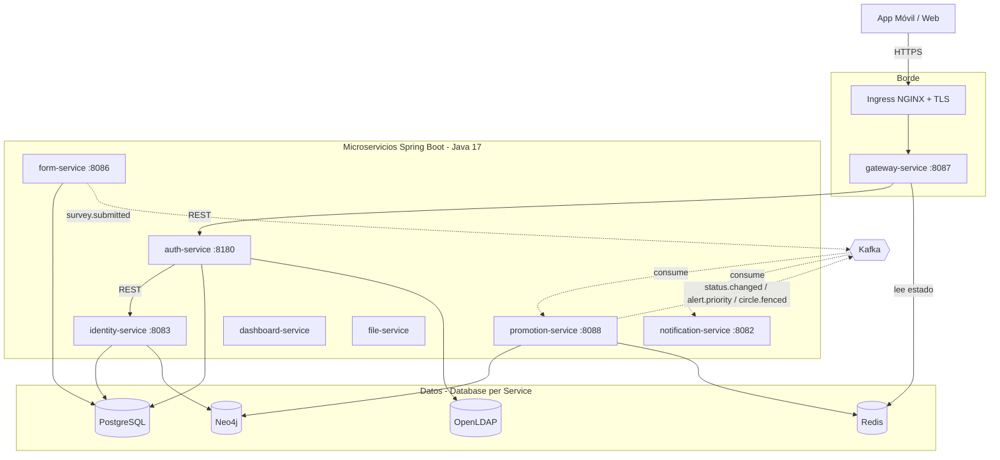
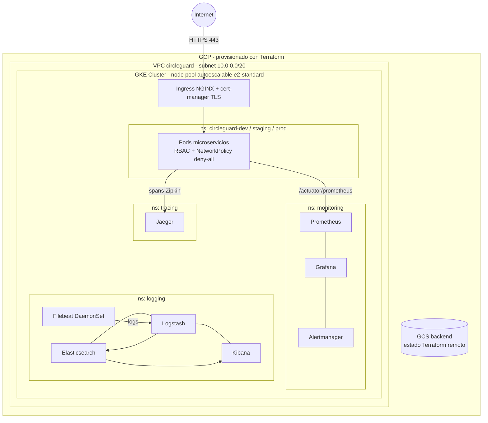

# Lineamientos Generales para Diagramas

Este documento establece cómo deben construirse los diagramas a lo largo de los entregables del Taller Final.

## 1. Herramienta y Formato
Todos los diagramas deben estar diseñados de forma que sean versionables o fácilmente incrustables.
*   **Preferencia:** `Mermaid.js` (Permite renderizar directamente en GitHub y Markdown).
*   **Alternativa:** `Draw.io` (Si el diagrama es muy complejo, se debe exportar la imagen a la carpeta `/docs/assets/` y mantener el XML de origen).

## 2. Arquitectura de Microservicios
El diagrama de arquitectura debe ilustrar:
- Los diferentes **servicios de Spring Boot** (Promotion, Auth, Gateway, etc.).
- Las bases de datos utilizadas y qué microservicio es el único dueño de cada una (ej. Neo4j para Promotion, PostgreSQL para Auth).
- El **Message Broker (Kafka)** que comunica de forma asíncrona los eventos entre microservicios.
- Las flechas deben ser direccionales e indicar si la llamada es síncrona (REST/gRPC) o asíncrona (Eventos).

## 3. Infraestructura y Despliegue (Kubernetes / AWS)
El diagrama de infraestructura generado por código debe incluir:
- **Redes:** VPCs, Subnets Públicas y Privadas.
- **Capa de Computo:** Nodos de EKS / Minikube, Ingress Controllers.
- **Seguridad:** Zonas de aislamiento, TLS endpoints.

*(Cualquier diagrama a incluirse en el repositorio debe apegarse a esta estructura).*

---

## 4. Diagrama de Arquitectura de Microservicios

> Flechas continuas = llamadas síncronas (REST). Flechas punteadas = eventos asíncronos vía Kafka.
> Cada servicio es dueño exclusivo de su almacén (patrón *Database per Service*).

## 5. Diagrama de Infraestructura y Despliegue

> El estado de Terraform vive en un backend remoto GCS, separado por *prefix* (dev/stage/prod).
> Las zonas de aislamiento se implementan con NetworkPolicies `default-deny` por namespace y RBAC por servicio.
