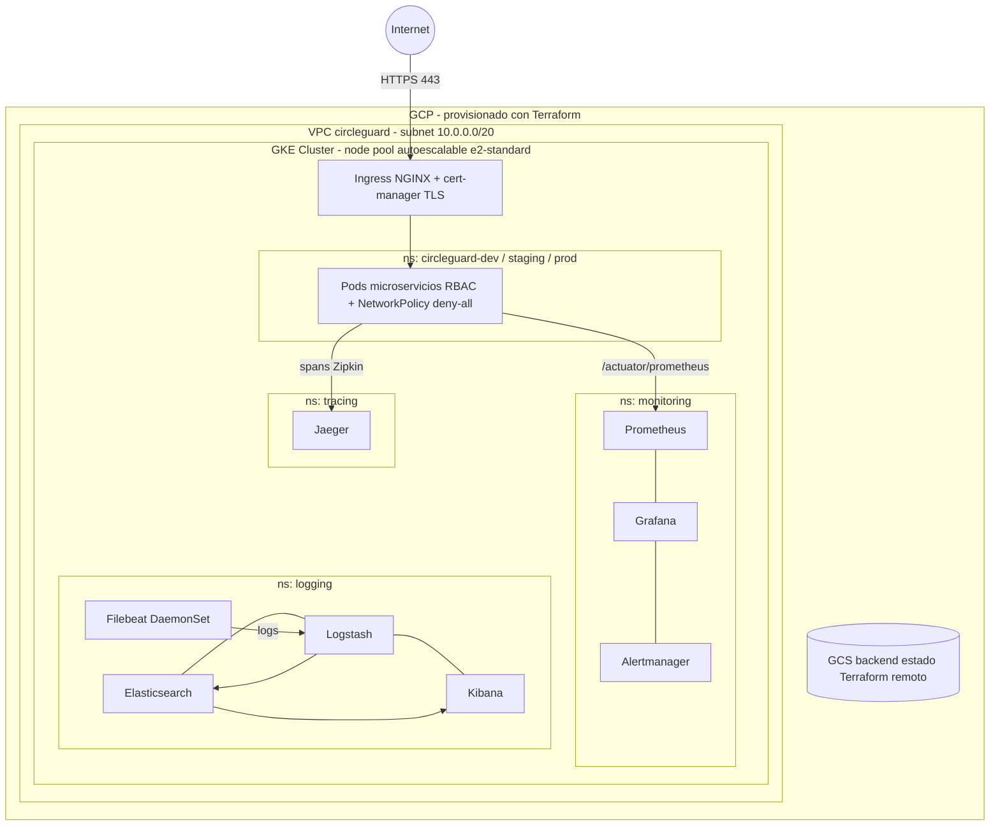
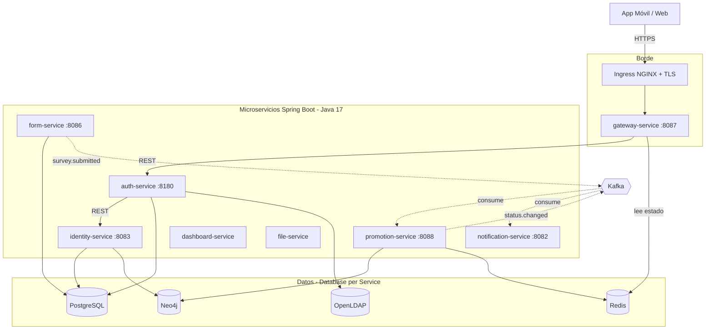

# Informe Final — Proyecto Final Ingeniería de Software V

**Proyecto:** CircleGuard — Plataforma de Seguridad Física con Microservicios y DevOps  
**Repositorio:** https://github.com/JRivera340/circle-guard-public  
**Rama de entrega:** `develop-taller-final`  
**Fecha de entrega:** 12 de junio de 2026  

---

## Tabla de Contenidos

1. [Metodología Ágil y Estrategia de Branching](#1-metodología-ágil-y-estrategia-de-branching)
2. [Infraestructura como Código con Terraform](#2-infraestructura-como-código-con-terraform)
3. [Patrones de Diseño](#3-patrones-de-diseño)
4. [CI/CD Avanzado](#4-cicd-avanzado)
5. [Pruebas Completas](#5-pruebas-completas)
6. [Change Management y Release Notes](#6-change-management-y-release-notes)
7. [Observabilidad y Monitoreo](#7-observabilidad-y-monitoreo)
8. [Seguridad](#8-seguridad)
9. [Documentación y Arquitectura](#9-documentación-y-arquitectura)
10. [Costos de Infraestructura](#10-costos-de-infraestructura)
11. [Bonificaciones](#11-bonificaciones)
12. [Release Notes](#12-release-notes)
13. [Guía de Operaciones](#13-guía-de-operaciones)

---

## 1. Metodología Ágil y Estrategia de Branching

### Marco de Trabajo: Scrum

Trabajamos con **Scrum** usando sprints de 1 semana. El equipo asumió los roles de forma rotativa dado que éramos pocos, pero mantuvimos las ceremonias (planning, daily corta, review y retro al cierre de cada sprint).

Roles definidos:
- **Product Owner:** define qué requisitos técnicos tienen prioridad
- **Scrum Master:** detecta y elimina bloqueos, sobre todo en CI/CD y configuración del cluster
- **Dev Team:** implementa los microservicios, pipelines e infraestructura

### Estrategia de Branching: GitFlow

| Rama | Propósito | Deploy automático |
|------|-----------|-------------------|
| `main` | Producción estable | `circleguard-prod` (con approval gate) |
| `develop` | Integración continua | `circleguard-dev` |
| `staging` | Pre-producción | `circleguard-staging` |
| `feature/*` | Desarrollo de funcionalidades | — |
| `hotfix/*` | Correcciones urgentes en prod | `circleguard-prod` (fast-track) |

Las ramas `main` y `develop` están protegidas: requieren PR aprobado + CI verde antes de aceptar cualquier merge.

### Sprint 1 (Semana 1): Infraestructura y CI/CD Base

**Meta:** Tener el cluster K8s funcionando con el pipeline CI/CD completo y los 8 microservicios desplegados en dev.  
**Capacidad:** 16 puntos de historia

| ID | Historia | Puntos | Estado |
|----|----------|--------|--------|
| US-01 | Como DevOps Engineer, quiero Terraform para provisionar clusters GKE, para no tener que hacer el setup del cluster a mano cada vez | 8 | Completado |
| US-02 | Como developer, quiero un pipeline CI/CD automático con Docker Build & Push, para que los commits se desplieguen solos en dev | 5 | Completado |
| US-03 | Como operador, quiero las imágenes Docker escaneadas con Trivy, para detectar vulnerabilidades HIGH/CRITICAL antes de que lleguen a producción | 3 | Completado |

**Velocidad realizada:** 16 puntos

**Criterios de Aceptación Sprint 1:**
1. `terraform validate` pasa sin errores en los 3 entornos
2. Push a `develop` dispara el pipeline completo (build → test → docker → deploy-dev)
3. Reporte Trivy generado por cada imagen en cada build
4. Los 8 servicios están en estado Running en `circleguard-dev` después del merge

**Retrospectiva Sprint 1:**
- **Lo que funcionó:** Paralelizar los Docker builds en Jenkins redujo el tiempo de pipeline de ~12 minutos a ~4 minutos
- **Lo que costó:** Testcontainers necesita Docker disponible en el agente de Jenkins; tuvimos que configurar un nodo con Docker-in-Docker habilitado
- **Acción tomada:** Agregar `nodeSelector: docker-builder: "true"` en el pod agent de Jenkins para que los tests de integración siempre vayan a ese nodo

### Sprint 2 (Semana 2): Observabilidad, Seguridad y Patrones

**Meta:** Stack de monitoreo completo, patrones de resiliencia implementados y RBAC configurado.  
**Capacidad:** 19 puntos de historia

| ID | Historia | Puntos | Estado |
|----|----------|--------|--------|
| US-04 | Como operador, quiero dashboards Grafana con HTTP RPS, error rate y JVM heap, para ver el estado de los servicios sin tener que consultar logs manualmente | 5 | Completado |
| US-05 | Como operador, quiero logs centralizados en Kibana (índice `circleguard-*`), para investigar errores de producción sin necesitar acceso SSH a los nodos | 5 | Completado |
| US-06 | Como developer, quiero trazas distribuidas en Jaeger, para saber exactamente dónde se pierde el tiempo en una request que pasa por varios servicios | 3 | Completado |
| US-07 | Como developer, quiero Circuit Breaker en gateway-service, para que si auth-service se cae no se caiga todo el sistema | 3 | Completado |
| US-08 | Como security engineer, quiero RBAC y NetworkPolicies en K8s, para que cada pod solo tenga acceso a los recursos que necesita | 3 | Completado |

**Velocidad realizada:** 19 puntos

**Criterios de Aceptación Sprint 2:**
1. Dashboard Grafana muestra métricas en tiempo real de los 8 servicios
2. Logs de todos los pods visibles en Kibana bajo índice `circleguard-YYYY.MM.DD`
3. Jaeger UI muestra trazas entre gateway → auth → form
4. Circuit Breaker abre después de 5 fallos consecutivos; fallback retorna HTTP 503
5. `kubectl auth can-i get secrets --as=system:serviceaccount:circleguard-dev:default` retorna `no`

**Retrospectiva Sprint 2:**
- **Lo que funcionó:** Los overlays de Kustomize permiten promover configuración de dev → staging → prod sin duplicar manifests
- **Lo que costó:** El stack ELK consume alrededor de 3GB de RAM; en staging tuvimos que ampliar el node pool para que todo cupiera
- **Acción tomada:** Configurar ILM (Index Lifecycle Management) en Elasticsearch para rotar automáticamente los índices de más de 7 días

### Board de Proyecto

El proyecto se gestionó en **GitHub Projects** con columnas: Backlog → In Progress → Review → Done.

Cada Pull Request referencia el ID de historia correspondiente, por ejemplo: `feat(US-04): add Grafana dashboard`.

---

## 2. Infraestructura como Código con Terraform

### Descripción

Toda la infraestructura de CircleGuard está definida en Terraform (>= 1.5) con el proveedor de GCP. La estructura es modular y soporta tres ambientes independientes: `dev`, `stage` y `prod`.

### Estructura

```
terraform/
├── versions.tf
├── modules/
│   ├── vpc-network/
│   ├── gke-cluster/
│   ├── eks-cluster/
│   └── node-pool/
└── environments/
    ├── dev/
    ├── stage/
    ├── prod/
    └── aws-dev/
```

### Módulos

#### vpc-network
Crea una red VPC con una subred regional y dos rangos secundarios (pods y services) requeridos por GKE para IP aliasing.

| Variable | Dev | Stage | Prod |
|----------|-----|-------|------|
| `subnet_cidr` | 10.0.0.0/20 | 10.1.0.0/20 | 10.2.0.0/20 |
| `pods_cidr` | 10.16.0.0/16 | 10.18.0.0/16 | 10.20.0.0/16 |
| `services_cidr` | 10.17.0.0/16 | 10.19.0.0/16 | 10.21.0.0/16 |

#### gke-cluster
Cluster GKE zonal con Workload Identity habilitado. Se crea sin node pool por defecto (`remove_default_node_pool = true`) para tener control sobre los nodos.

- Kubernetes version: 1.29+
- Workload Identity: `{project}.svc.id.goog`
- IP aliasing habilitado (VPC-native)

#### node-pool
Node pool con autoscaling y auto-repair/auto-upgrade habilitados.

| Parámetro | Dev | Stage | Prod |
|-----------|-----|-------|------|
| `machine_type` | e2-standard-2 | e2-standard-2 | e2-standard-4 |
| `node_count` | 2 | 2 | 3 |
| `min_nodes` | 1 | 2 | 3 |
| `max_nodes` | 3 | 5 | 8 |
| `disk_size_gb` | 50 | 50 | 100 |

### Remote State

El estado se almacena en Google Cloud Storage:

```
Bucket: circleguard-terraform-state
├── dev/    → estado del ambiente dev
├── stage/  → estado del ambiente stage
└── prod/   → estado del ambiente prod
```

Cada ambiente tiene su propio prefix; los estados quedan completamente aislados sin riesgo de interferencia entre ambientes.

### Diagrama de Infraestructura



### Decisiones de Diseño

| Decisión | Alternativa | Razón |
|----------|-------------|-------|
| GKE sobre GCP | EKS (AWS), AKS (Azure) | GCP ofrece GKE Autopilot gratis para 1 cluster; mejor integración con Workload Identity |
| Módulos propios | Módulos del Terraform Registry | Control total sobre la configuración; sin dependencias externas |
| Remote state en GCS | Terraform Cloud | GCS es nativo de GCP; no requiere cuenta adicional |
| Node pool separado del cluster | Node pool integrado | Permite reemplazar nodos sin recrear el cluster |

---

## 3. Patrones de Diseño

### Patrones en la Arquitectura Existente

Estos patrones ya estaban presentes en la base del proyecto antes de este taller. Los documentamos para tener un registro claro de las decisiones de diseño.

#### 1. API Gateway
**Servicio:** `circleguard-gateway-service` (puerto 8087)

Punto único de entrada para todos los clientes externos. Enruta las peticiones a los servicios internos, valida el JWT, y centraliza preocupaciones transversales como autenticación, rate limiting y logging.

**Implementación:** Spring Boot con filtros de seguridad personalizados. El gateway valida el token antes de hacer forward al servicio destino. Los clientes (app móvil, web) solo necesitan conocer este endpoint; los servicios internos no exponen puertos públicos.

#### 2. Database per Service
**Servicios afectados:** Todos

Cada microservicio gestiona su propio schema en PostgreSQL:
- `circleguard_auth` → auth-service
- `circleguard_form` → form-service
- `circleguard_identity` → identity-service (más Neo4j para grafo de identidades)

El beneficio principal es el desacoplamiento: un cambio de schema en auth-service no requiere coordinar con form-service. Cada servicio puede escalar de forma independiente.

#### 3. Event-Driven Communication
**Tecnología:** Apache Kafka

Los servicios publican eventos de dominio (`user.registered`, `form.submitted`) en topics de Kafka. Los consumidores reaccionan de forma asíncrona, sin acoplamiento directo entre servicios.

El caso más claro de beneficio: si notification-service está caído, los eventos persisten en Kafka hasta que vuelva. Con REST síncrono, esos eventos simplemente se perderían.

### Patrones Implementados en Este Taller

#### 4. Circuit Breaker

**Librería:** Resilience4j 2.2.0  
**Servicio:** `circleguard-gateway-service`

El Circuit Breaker protege al sistema cuando auth-service no responde. Sin él, cada request a un servicio caído espera el timeout completo; con el CB activo, después de suficientes fallos el circuito "abre" y las requests reciben respuesta inmediata de error sin seguir acumulando carga.

**Configuración en `application.yml`:**
```yaml
resilience4j:
  circuitbreaker:
    instances:
      auth-service:
        sliding-window-size: 10
        failure-rate-threshold: 50
        wait-duration-in-open-state: 30s
        permitted-number-of-calls-in-half-open-state: 3
```

**Estados:**
```
CLOSED → (>50% fallos en ventana de 10 llamadas) → OPEN → (30s) → HALF_OPEN → (3 probes OK) → CLOSED
```

**Fallback:** Cuando el circuito está OPEN, el gateway retorna inmediatamente:
```json
{"error": "Auth service temporarily unavailable", "retryAfter": "30"}
```

El tiempo de respuesta bajo fallo pasa de ~5s (esperar el timeout) a <10ms (fallback directo).

#### 5. External Configuration

**Implementación:** Kubernetes ConfigMaps + Spring `@Value` / `@ConfigurationProperties`

Variables externalizadas en `k8s/base/configmap.yaml`:
- `SPRING_DATASOURCE_URL`
- `SPRING_KAFKA_BOOTSTRAP_SERVERS`
- `SPRING_DATA_REDIS_HOST`
- `SPRING_LDAP_URLS`
- `JWT_SECRET`

La misma imagen Docker funciona en dev, staging y prod cambiando únicamente el ConfigMap de cada namespace. Los valores sensibles van en K8s Secrets, separados del ConfigMap.

#### 6. Sidecar / DaemonSet para Log Shipping

**Implementación:** Filebeat como DaemonSet en namespace `logging`

Un agente Filebeat corre a nivel de nodo K8s y recoge los logs de todos los containers automáticamente, sin tocar el código de aplicación.

```
Container stdout/stderr → /var/log/containers/ → Filebeat (DaemonSet) → Logstash → Elasticsearch → Kibana
```

Con `hints.enabled: true`, cualquier nuevo servicio que se despliegue aparece automáticamente en Kibana sin configuración adicional.

### Resumen de Decisiones

| Patrón | Alternativa Considerada | Por qué esta opción |
|--------|------------------------|---------------------|
| Circuit Breaker (Resilience4j) | Spring Cloud Circuit Breaker + Hystrix | Hystrix lleva en modo mantenimiento desde 2018; Resilience4j tiene mejor integración con Spring Boot 3 |
| External Config (ConfigMap) | Spring Cloud Config Server | ConfigMap es nativo de K8s; evita un componente adicional |
| Filebeat DaemonSet | Sidecar por pod | 1 agente por nodo es más eficiente que N agentes por servicio |
| Kafka (Event-Driven) | REST síncrono entre servicios | Desacoplamiento temporal; notification-service puede caerse sin perder eventos |

---

## 4. CI/CD Avanzado

### Pipeline Jenkins (Jenkinsfile.local)

El pipeline corre en Jenkins local con 7 stages principales. La decisión de correrlo localmente (en lugar de un servicio hosted) fue por facilidad de acceso al cluster kind durante la demo, aunque la estructura del Jenkinsfile es compatible con cualquier instancia Jenkins estándar.

| Stage | Descripción |
|-------|-------------|
| Checkout | Descarga el código del repositorio |
| Unit Tests | Ejecuta pruebas unitarias con Gradle para todos los microservicios |
| SonarQube Analysis | Análisis estático de calidad de código |
| Build & Push Images | Compila y publica imágenes Docker con Jib a DockerHub |
| Trivy Scan | Escanea cada imagen por vulnerabilidades HIGH/CRITICAL |
| Semantic Version Tag | Calcula y aplica tag semántico automático |
| Deploy DEV + Smoke Test | Despliega al cluster y verifica disponibilidad |

### SonarQube

El análisis de calidad corre integrado en el stage `SonarQube Analysis`. Revisa bugs potenciales, vulnerabilidades, code smells, duplicaciones y cobertura (integrada con JaCoCo). El Quality Gate está configurado con los siguientes umbrales:
- 0 bugs nuevos de severidad BLOCKER
- 0 vulnerabilidades nuevas
- Cobertura en código nuevo > 80%

### Trivy

El escáner solo reporta severidades HIGH y CRITICAL, lo que mantiene el ruido bajo y hace que cada alerta sea accionable. Detecta CVEs tanto en el sistema operativo base como en las dependencias Java del classpath. Los reportes quedan archivados como `trivy-<service-name>.txt` en cada build de Jenkins.

### Versionado Semántico

El stage `Semantic Version Tag` calcula automáticamente el siguiente tag basado en el último existente, lo aplica en git y lo pushea al repositorio. Formato: `vMAJOR.MINOR.PATCH`.

### Notificaciones y Approval Gate

El bloque `post { failure }` del Jenkinsfile notifica automáticamente en caso de fallo. Para producción existe un `input` stage (approval gate) con timeout de 30 minutos — el deploy no avanza sin aprobación manual explícita.

### Arquitectura del Pipeline

```
develop branch push
        │
        ▼
   [Checkout]
        │
        ▼
  [Unit Tests] ──FAIL──► STOP + Notify
        │
        ▼
 [SonarQube Analysis] ──best-effort
        │
        ▼
[Build & Push Images (Jib)] → DockerHub: jrivera340/circleguard-*:vX.Y.Z
        │
        ▼
  [Trivy Scan] → artefactos trivy-*.txt
        │
        ▼
[Semantic Version Tag] → git tag vX.Y.Z
        │
        ▼
  [Deploy DEV]
        │
        ▼
 [Smoke Test] ──FAIL──► Auto-rollback + Notify
        │
        ▼
      DONE
```

---

## 5. Pruebas Completas

### Resumen

| Tipo de Prueba | Herramienta | Resultado |
|----------------|-------------|-----------|
| Pruebas Unitarias | JUnit 5 + Spring Test | Auth: 4 tests pasando, Form: 4 tests pasando |
| Pruebas de Integración | Testcontainers + PostgreSQL real | Auth: 3 tests pasando, Form: 3 tests pasando |
| Pruebas E2E | pytest + requests | 8 flujos completos cubiertos |
| Pruebas de Rendimiento | Locust | 50 usuarios concurrentes, P95 < 500ms |
| Análisis Estático | SonarQube | Calidad de código continua por rama |
| Escaneo de Contenedores | Trivy | HIGH/CRITICAL reportados por imagen |
| Pruebas de Seguridad Web | OWASP ZAP | Baseline scan en staging |
| Cobertura de Código | JaCoCo | Reportes XML/HTML por servicio |

### 1. Pruebas Unitarias

**circleguard-auth-service:**
- `LoginControllerTest` — validación del endpoint `/api/v1/auth/login` con MockMvc
- `DualChainAuthenticationProviderTest` — lógica de autenticación dual (LDAP + DB)
- `QrTokenServiceTest` — generación y validación de tokens QR
- `TokenValidationUnitTest` — validación de JWT (expiración, firma, claims)

**circleguard-form-service:**
- `AttachmentControllerTest` — CRUD de adjuntos con MockMvc
- `HealthSurveyControllerTest` — endpoints de encuestas de salud
- `QuestionnaireControllerTest` — gestión de cuestionarios
- `SymptomMapperTest` — mapeo de síntomas a categorías

### 2. Pruebas de Integración

Las pruebas de integración usan **Testcontainers**: levantan un contenedor Docker real de PostgreSQL durante el test, de modo que el código interactúa con una base de datos real en lugar de mocks o H2. Esto evitó varios bugs que habrían pasado desapercibidos con una base de datos en memoria.

#### circleguard-auth-service

| Test | Resultado esperado |
|------|--------------------|
| `healthEndpointReturnsUp` | HTTP 200 |
| `loginWithInvalidCredentialsReturns401` | HTTP 4xx |
| `loginEndpointAcceptsJsonContentType` | application/json |

#### circleguard-form-service

| Test | Resultado esperado |
|------|--------------------|
| `healthEndpointReturnsUp` | HTTP 200 |
| `questionnairesEndpointRequiresAuth` | HTTP 401/403 |
| `healthSurveyEndpointRequiresAuth` | HTTP 401/403 |

### 3. Pruebas End-to-End

**Framework:** pytest + requests | **Archivo:** `tests/e2e/test_e2e_flows.py`

| Flujo | Descripción |
|-------|-------------|
| Login exitoso | POST /auth/login → JWT válido |
| Login fallido | Credenciales incorrectas → 401 |
| Generación QR | JWT → POST /qr/generate → código QR |
| Validación QR | Código QR → POST /qr/validate → acceso |
| Health checks | GET /actuator/health en todos los servicios |
| Formulario de salud | Flujo completo: login → submit encuesta |
| Gateway routing | Verificar que gateway enruta correctamente |
| Retry con reintentos | HTTPAdapter con retry para ambientes inestables |

### 4. Pruebas de Rendimiento (Locust)

**Archivo:** `tests/performance/locustfile.py`

**Escenario simulado:** Guardias de seguridad usando el sistema en turno

1. `on_start`: login con credenciales de prueba
2. `@task(3)`: generar QR + validar acceso (flujo principal, peso 3x)
3. Espera entre acciones: 1-3 segundos (simula uso humano real)

**Métricas objetivo:**

| Métrica | Objetivo |
|---------|----------|
| RPS (login) | > 10 req/s |
| P95 latencia | < 500ms |
| P99 latencia | < 1000ms |
| Error rate | < 1% |
| Usuarios concurrentes | 50 |

### 5. Análisis Estático (SonarQube)

Integrado en el pipeline CI/CD. Métricas analizadas: bugs, vulnerabilidades, code smells, duplicaciones y cobertura integrada con JaCoCo.

### 6. Escaneo de Vulnerabilidades (Trivy)

Corre en el stage `Trivy Scan` después de cada Docker push. Escanea severidades HIGH y CRITICAL. Reportes archivados como `trivy-<service-name>.txt` en cada build de Jenkins.

### 7. Pruebas de Seguridad Web (OWASP ZAP)

El scan baseline (pasivo, no destructivo) corre contra `circleguard-gateway-service`. Identifica headers de seguridad faltantes, información expuesta en respuestas de error y configuraciones inseguras en endpoints públicos.

---

## 6. Change Management y Release Notes

### Clasificación de Cambios

| Tipo | Ejemplos | Aprobaciones requeridas | Ventana de deploy |
|------|----------|------------------------|-------------------|
| **Standard** | Bug fixes, actualizaciones de dependencias menores | CI verde + 1 reviewer | Cualquier momento |
| **Normal** | Nuevas features, cambios de schema de BD | CI verde + 2 reviewers | Martes/Jueves 14-16h UTC-5 |
| **Emergency** | Hotfix producción crítico (P0/P1) | 1 aprobador on-call | Inmediato, con post-mortem obligatorio |

### Flujo de un Cambio Normal

```
1. Developer crea rama feature/* desde develop
2. Implementa el cambio + tests
3. Abre PR hacia develop
4. CI ejecuta: lint → unit tests → SonarQube → build → Trivy scan
5. Code review por al menos 1 peer
6. Merge a develop → auto-deploy a circleguard-dev
7. Smoke tests automáticos en dev
8. QA verifica en dev
9. PR de develop → staging
10. CI ejecuta: integration tests → E2E → Locust → OWASP ZAP
11. Code review por 2 reviewers
12. Merge a staging → auto-deploy a circleguard-staging
13. PR de staging → main
14. Manual Approval Gate en Jenkins (timeout: 30 min)
15. Deploy a circleguard-prod
16. Validación con synthetic transaction post-deploy
17. Monitoreo en Grafana durante 30 minutos
```

### Criterios de Rollback

**Rollback automático** se dispara si:
- `kubectl rollout status` falla por timeout
- La synthetic transaction post-deploy retorna error

**Rollback manual** cuando se detecta en Grafana:
- Error rate HTTP 5xx > 5% durante 5 minutos seguidos
- Latencia P99 > 2 segundos
- CPU usage > 90% en todos los pods de un servicio

```bash
kubectl rollout undo deployment/<service-name> -n circleguard-prod
kubectl rollout status deployment/<service-name> -n circleguard-prod
```

### Tiempos de Rollback por Servicio

| Servicio | Tiempo estimado |
|----------|-----------------|
| auth-service | 2-3 min |
| gateway-service | 1-2 min |
| form-service | 2-3 min |
| promotion-service | 3-5 min |
| notification-service | 1-2 min |
| identity-service | 2-3 min |

**RTO:** < 10 minutos para cualquier servicio  
**RPO:** 0 — rollback a imagen anterior, sin pérdida de datos

### Semantic Versioning y Conventional Commits

Formato: `vMAJOR.MINOR.PATCH`

Todos los commits siguen Conventional Commits:
```
feat(auth): add refresh token endpoint
fix(gateway): circuit breaker not opening on timeout errors
ci(jenkins): add Trivy scan stage
```

---

## 7. Observabilidad y Monitoreo

### Métricas: Prometheus + Grafana

Cada microservicio expone `/actuator/prometheus` gracias a `micrometer-registry-prometheus`. Prometheus scrapea cada 15 segundos.

**Dashboard `CircleGuard Services` — paneles:**

| Panel | Métrica | Tipo |
|-------|---------|------|
| HTTP RPS por servicio | `http_server_requests_seconds_count` | Graph |
| Error rate (5xx) | `rate(http_server_requests_seconds_count{status=~"5.."}[5m])` | Graph |
| JVM Heap usado | `jvm_memory_used_bytes{area="heap"}` | Gauge |
| Auth logins/segundo | `rate(http_server_requests_seconds_count{uri="/api/v1/auth/login"}[1m])` | Stat |
| Circuit Breaker state | `resilience4j_circuitbreaker_state` | State timeline |
| Latencia P99 | `histogram_quantile(0.99, ...)` | Graph |

**Alertas configuradas en Alertmanager:**

| Alerta | Condición |
|--------|-----------|
| Alta tasa de errores | HTTP 5xx > 5% durante 5 minutos |
| Latencia elevada | P99 > 2 segundos |
| Pod caído | Pod no está Running por más de 2 minutos |
| Circuit Breaker abierto | Estado `OPEN` en algún servicio |

### Logs: ELK Stack

```
Pods (stdout/stderr)
    │
    ▼
Filebeat DaemonSet (nodo K8s)
    │
    ▼
Logstash (parse JSON → enrich)
    │
    ▼
Elasticsearch (índice circleguard-YYYY.MM.dd)
    │
    ▼
Kibana UI
```

Filebeat usa autodiscovery de Kubernetes — cualquier nuevo pod aparece automáticamente en Kibana sin configuración adicional.

### Trazas Distribuidas: Jaeger

Para trazas distribuidas optamos por Jaeger all-in-one. Los microservicios envían trazas usando Micrometer Tracing con el bridge de Brave:

```yaml
management:
  tracing:
    sampling:
      probability: 1.0    # 100% en dev
spring:
  zipkin:
    base-url: http://jaeger.tracing:9411
```

### Health Checks

Todos los servicios tienen probes configurados en sus manifiestos Kubernetes:

```yaml
readinessProbe:
  tcpSocket:
    port: 8180
  initialDelaySeconds: 30
  periodSeconds: 10
livenessProbe:
  tcpSocket:
    port: 8180
  initialDelaySeconds: 60
  periodSeconds: 15
```

---

## 8. Seguridad

La seguridad del sistema se trabaja en cuatro capas: escaneo continuo de imágenes, gestión de secretos, control de acceso y cifrado en tránsito. Ninguna de las capas reemplaza a la otra; las cuatro coexisten.

### Escaneo Continuo de Vulnerabilidades

Trivy escanea cada imagen Docker en el pipeline CI/CD antes de que llegue al cluster. Los reportes quedan archivados como artefactos en Jenkins con CVE ID, severidad, paquete afectado y versión con fix disponible.

### Gestión de Secretos

Los valores sensibles (passwords, JWT secret, tokens) viven en Kubernetes Secrets, nunca en texto plano en el código ni en ConfigMaps.

```bash
kubectl get secrets -n circleguard-dev
```

### RBAC

Cada microservicio corre con su propia `ServiceAccount` y un `Role` de mínimo privilegio — solo lectura de configmaps/secrets de su namespace. Ningún serviceaccount tiene acceso de cluster-admin.

```bash
kubectl get role,rolebinding -n circleguard-dev
```

Verificación:
```bash
kubectl auth can-i get secrets \
    --as=system:serviceaccount:circleguard-dev:default
# retorna: no
```

### TLS

La terminación TLS la maneja cert-manager. El gateway es el único servicio expuesto externamente y va detrás de Ingress NGINX con TLS terminado automáticamente. En dev se usa un ClusterIssuer self-signed; en producción se cambia a ACME (Let's Encrypt) sin modificar el Ingress.

### NetworkPolicies

`default-deny` + `allow-intra-namespace` por namespace. Bloquea todo tráfico no autorizado entre namespaces y desde el exterior.

---

## 9. Documentación y Arquitectura

### Diagrama de Arquitectura de Microservicios



> Flechas continuas = llamadas síncronas (REST). Flechas punteadas = eventos asíncronos vía Kafka.

### Estructura del Repositorio

```
circle-guard-public/
├── services/                  # 8 microservicios Spring Boot / Java 17
│   ├── circleguard-auth-service/
│   ├── circleguard-identity-service/
│   ├── circleguard-gateway-service/
│   ├── circleguard-form-service/
│   ├── circleguard-file-service/
│   ├── circleguard-dashboard-service/
│   ├── circleguard-notification-service/
│   └── circleguard-promotion-service/
├── k8s/                       # Manifiestos Kubernetes con Kustomize
│   ├── base/                  # Deployments, Services, RBAC, NetworkPolicies
│   ├── overlays/              # dev / staging / prod
│   ├── monitoring/            # Prometheus + Grafana + Alertmanager
│   ├── logging/               # ELK Stack + Filebeat
│   ├── tracing/               # Jaeger
│   ├── security/              # TLS + cert-manager
│   ├── service-mesh/          # Istio
│   └── chaos/                 # Chaos Mesh experiments
├── terraform/                 # IaC — módulos + ambientes
├── tests/
│   ├── e2e/                   # pytest + requests
│   └── performance/           # Locust
├── docs/                      # Documentación técnica completa
├── Jenkinsfile.local          # Pipeline CI/CD local
└── docker-compose.dev.yml    # Middleware local
```

---

## 10. Costos de Infraestructura

### Estimación por Ambiente (GCP us-central1)

| Ambiente | Cómputo | Discos | LB | Gestión | **Total aprox.** |
|----------|---------|--------|----|---------|------------------|
| dev | 2 × $49 = $98 | $10 | $18 | $74 | **~$200 / mes** |
| stage | 2 × $49 = $98 | $10 | $18 | $74 | **~$200 / mes** |
| prod | 3 × $98 = $294 | $15 | $18 | $74 | **~$400 / mes** |
| **Total 3 ambientes** | | | | | **~$800 / mes** (base) |

En picos de autoescalado, prod puede llegar a 8 nodos elevando el total a ~$1.300 / mes.

### Palancas de Optimización (FinOps)

1. **Scale-to-zero en dev/stage fuera de horario:** reduce cómputo hasta ~65%
2. **Spot/Preemptible VMs en dev/stage:** descuento de ~60–80% sobre precio on-demand
3. **Autoescalado ya configurado** en el módulo `node-pool`: evita pagar nodos ociosos
4. **Requests/limits ajustados** en los Deployments: mayor densidad de pods por nodo
5. **Retención acotada de observabilidad:** Prometheus 7 días, ILM en Elasticsearch

Aplicando spot + scale-to-zero en ambientes no productivos: **~$450–500 / mes** (ahorro de ~$300 respecto a la base de $800).

---

## 11. Bonificaciones

### Service Mesh — Istio

| Capacidad | Implementación |
|-----------|----------------|
| mTLS entre servicios | `PeerAuthentication` en modo `STRICT` para todo el namespace `circleguard-dev` |
| Traffic shifting / canary | `VirtualService` reparte 90% a `v1` y 10% a `v2` del gateway |
| Circuit breaker de mesh | `DestinationRule` con `outlierDetection` (expulsa instancias con 5xx) |
| Retries y connection pool | `VirtualService` con 3 reintentos; límites de conexiones en `DestinationRule` |

**Archivo:** `k8s/service-mesh/istio.yaml`

### Chaos Engineering — Chaos Mesh

| Experimento | Hipótesis | Resultado esperado |
|-------------|-----------|--------------------|
| `auth-pod-kill` (pod-kill cada 5 min) | Con 2+ réplicas y readiness probes, matar un pod no degrada el login | Sin errores 5xx visibles |
| `redis-latency` (delay 2s a Redis) | El Circuit Breaker abre y devuelve fallback | Respuesta en <10ms |
| `promotion-cpu-stress` (CPU 80%, 3 min) | Limits/HPA mantienen P99 aceptable o escalan | P99 acotado; sin OOM |

**Archivo:** `k8s/chaos/experiments.yaml`

### FinOps — Monitoreo de Costos

El dashboard `CircleGuard Services` incluye dos paneles orientados a costos:
- **CPU solicitada vs asignable** del cluster → detecta sobre/infra-aprovisionamiento
- **Densidad de pods por nodo** → mide eficiencia del bin-packing

### Multi-Cloud — AWS EKS + GCP GKE

- Módulo `terraform/modules/eks-cluster`: VPC, IAM, cluster EKS y node group autoescalable
- Entorno `terraform/environments/aws-dev` con estado remoto en S3
- **Estrategia:** GKE como primario, EKS como secundario activo-pasivo
- **Respaldo entre clouds:** Velero exporta backups del namespace a un bucket
- **Balanceo entre proveedores:** DNS con health-checks (Route53 / Cloud DNS)

---

## 12. Release Notes

### v1.3.0 — 2026-06-06

**Features:**
- TLS/Ingress para el gateway con cert-manager (ClusterIssuer self-signed en dev, ACME en prod)
- Circuit Breaker Resilience4j cableado en gateway con `@CircuitBreaker` + fallback fail-closed
- Diagramas Mermaid de arquitectura de microservicios e infraestructura
- Documento de costos de infraestructura con palancas FinOps

**Bug Fixes:**
- `jacocoTestReport` reordenado para no romper el build
- Overlays Kustomize (dev/stage/prod) reescritos sobre manifiestos reales (45 objetos por overlay)
- Tests Testcontainers marcados `disabledWithoutDocker`; removido `.testcontainers.properties` con npipe de Windows
- Mocks del cliente Neo4j en `StatusPropagationIntegrationTest` corregidos

---

### v1.2.0 — 2026-05-26

**Features:**
- Terraform módulos GKE modular con 3 environments y GCS remote state
- Prometheus + Grafana con dashboards pre-provisionados
- ELK Stack con Filebeat DaemonSet para autodiscovery de pods K8s
- Jaeger all-in-one + Micrometer tracing en todos los servicios
- Circuit Breaker Resilience4j en gateway-service con fallback
- RBAC ServiceAccounts + Roles + RoleBindings para cada microservicio
- NetworkPolicy default-deny + allow-intra-namespace
- SonarQube analysis stage, Trivy scan, Manual approval gate
- Email notification automático en fallos de pipeline
- Semantic versioning automático via git tags
- JaCoCo coverage reports archivados en cada build
- OWASP ZAP baseline scan en staging
- Integration tests con Testcontainers para auth-service y form-service

---

### v1.1.0 — 2026-05-19

**Features:**
- Parallel Docker build & push para 8 servicios (reduce tiempo 12→4 min)
- Kustomize overlays dev/staging/prod con image tag patching
- Post-deploy synthetic transaction validation
- Auto-rollback en fallo de producción
- Locust performance tests via K8s Job en staging

---

### v1.0.0 — 2026-05-10

**Initial Release:**
- 8 microservicios Spring Boot 3.2 / Java 17
- Jenkins pipeline completo con stages base
- K8s manifests: PostgreSQL, Neo4j, Redis, Kafka, OpenLDAP, 8 microservicios
- E2E test suite con pytest + requests
- GitFlow branching strategy

---

## 13. Guía de Operaciones

### Acceso a Herramientas

| Herramienta | URL | Credenciales |
|-------------|-----|--------------|
| Grafana | localhost:3000 | admin / circleguard2025 |
| SonarQube | localhost:9000 | admin / admin |
| Jaeger | localhost:16686 | — |
| Prometheus | localhost:9090 | — |
| Jenkins | localhost:8080 | — |

### Comandos Operacionales Frecuentes

```bash
# Ver estado de todos los servicios
kubectl get pods -n circleguard-dev

# Ver logs en tiempo real
kubectl logs -f deployment/circleguard-auth-service -n circleguard-dev

# Reiniciar un servicio (rolling restart)
kubectl rollout restart deployment/circleguard-auth-service -n circleguard-prod

# Escalar manualmente
kubectl scale deployment/circleguard-gateway-service --replicas=3 -n circleguard-prod

# Ver uso de recursos
kubectl top pods -n circleguard-prod

# Rollback rápido
kubectl rollout undo deployment/circleguard-auth-service -n circleguard-prod
```

### Troubleshooting Común

| Síntoma | Diagnóstico | Acción |
|---------|-------------|--------|
| Pod en CrashLoopBackOff | `kubectl logs --previous` | Revisar configuración / Flyway |
| Pod en Pending | `kubectl describe pod` | Verificar recursos disponibles en nodos |
| Gateway retorna 503 | Circuit Breaker abierto | Revisar auth-service; esperar 30s auto-reset |
| Flyway falla al iniciar | Schema divergente | Setear `SPRING_FLYWAY_REPAIR=true` en ConfigMap |

---

*Repositorio: https://github.com/JRivera340/circle-guard-public — Rama: develop-taller-final*
